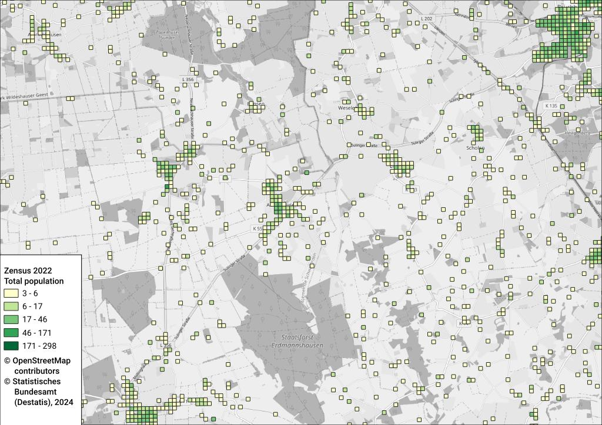
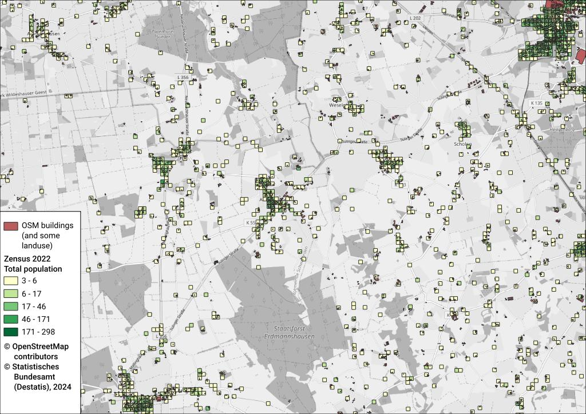
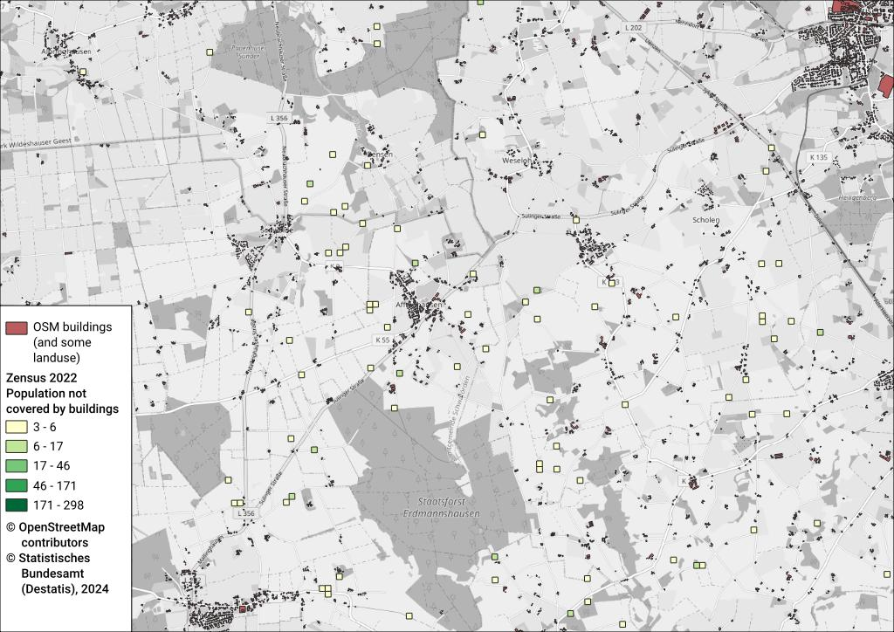
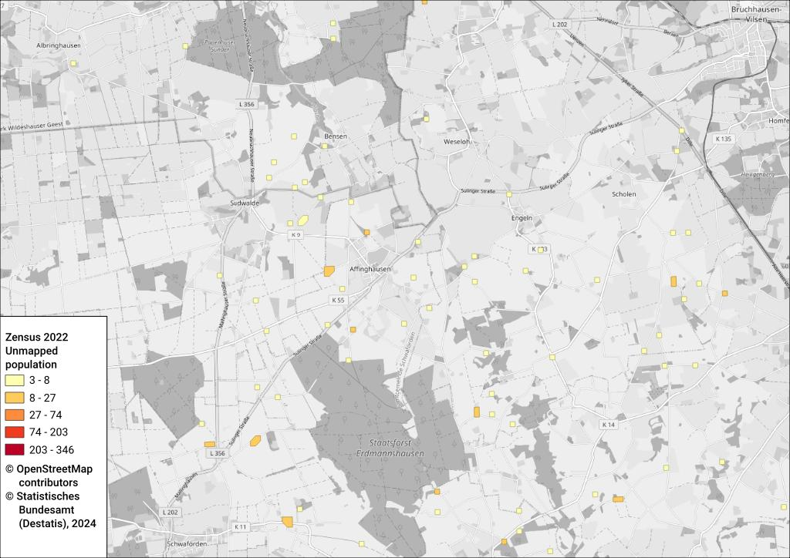
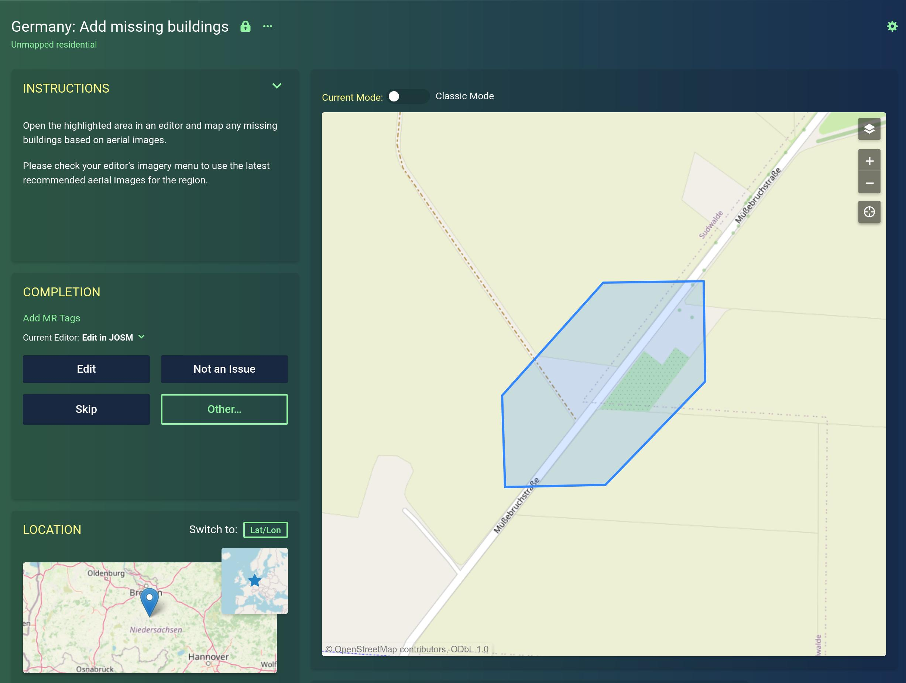

# [Maproulette: Germany – add missing buildings](https://maproulette.org/browse/challenges/48757)

Population data for  Germany is available on a high-resolution 100 m grid from
the
[census 2022](https://www.zensus2022.de/DE/Ergebnisse-des-Zensus/_inhalt.html).
By comparing this data to buildings, one can find areas in Germany that are not
yet mapped in [OpenStreetMap](https://www.openstreetmap.org/). These are mostly
farms, weekend homes and some new construction.

The identified unmapped areas are fed as mapping tasks into
[Maproulette](https://maproulette.org/browse/challenges/48757), a micro-tasking
platform for OpenStreetMap contributors, where they can improve the map one
small issue at a time.

An earlier version of this project was run in 2020, see tag
[v1.0](https://github.com/hfs/unmapped-census/tree/v1.0) of this repository.


## Data sources

1. German Census 2022:
   [Population on 100 m grid](https://www.zensus2022.de/DE/Ergebnisse-des-Zensus/_inhalt.html)
   (“Bevölkerungszahlen in Gitterzellen”). Keep in mind that the data is based
   on the cut-off date 2022-05-15 and things may have changed since then or the
   latest construction is not reflected in the data.
2. [OpenStreetMap dump for Germany from Geofabrik](https://download.geofabrik.de/europe/germany.html)


## Processing steps

### [01_download.sh](01_download.sh) – Download data

Download the input data.

### [02_createdb.sh](02_createdb.sh) – Create database

Create the PostGIS database where the data analysis will happen.

### [03_import_census.sh](03_import_census.sh) – Import census data

Import the data into the PostGIS database.

The data looks like this:



### [04_import_osm.sh](04_import_osm.sh) – Import OSM data

Filter the OpenStreetMap data for buildings and some other relevant land uses.
OpenStreetMap contains all kinds of geospatial data, e.g. roads, shops and
schools. We are only interested in areas where people live like residential
areas or buildings. Some other types of places need to be included like nursery
homes, hospitals, prisons or military barracks, where people may reside
permanently.

On this map you can see how these areas overlap with the census cells. We are
interested in the cells which are not yet covered by residential areas.



### [05_analyze.sh](05_analyze.sh) – Intersect the data sets

Now we filter the census cells to include only those that are not covered or
touched in any way by the relevant OSM objects. These identify areas that
should be looked at for sure.



Finally identify clusters of touching squares and merge them into single
polygons to identify each connected area that should become one task.

This map shows how the final output looks like:



Each one of the polygons is then presented as mapping task to the Maproulette
contributors. The outline indicates the rough area to check, but users will
then use satellite/aerial imagery to get the precise outline.




## How to run the analysis yourself

You can run the analysis yourself, e.g. for newer data or if you want to modify
the criteria.

The processing requires about 100 GB of temporary disk space and 1 hour of
computation time.


### Running via `podman`

The easiest way to get all required dependencies and run the pipeline is to use
[podman](https://podman.io/). It should be readily available as package on
recent Linux distributions. If you have `podman` installed you can run

```bash
podman play kube kube.yaml
```

This will first build the image defined in
[unmapped_census/](unmapped_census/Dockerfile) which contains all the required
dependencies.

It starts this image and PostgreSQL+PostGIS as two containers and runs
[run.sh](run.sh), which just calls the scripts 01 to 06.

The generated output data can be found in `data/unmapped_census.geojson`.


### Running manually

Install PostgreSQL, PostGIS, `osm2pgsql` and `osmium`.

Edit `env.sh` to set the PostgreSQL credentials.

Run `./run.sh` to execute all processing steps, or call the single scripts to
run specific steps.


## License

The source code of this project is licensed under the terms of the
[MIT license](LICENSE).

The census data may be used for derivative works, if you mention the source
“Statistisches Bundesamt ([www.destatis.de](https://www.destatis.de/))”. See
their
[imprint](https://www.zensus2022.de/DE/Service/Impressum/_inhalt.html)
for details.

As the output data is a Derivative Work of OpenStreetMap data, is has to be
licensed under [ODbL](https://opendatacommons.org/licenses/odbl/). Please refer
to the [OSM Copyright](https://www.openstreetmap.org/copyright/) page and the
information linked there.
